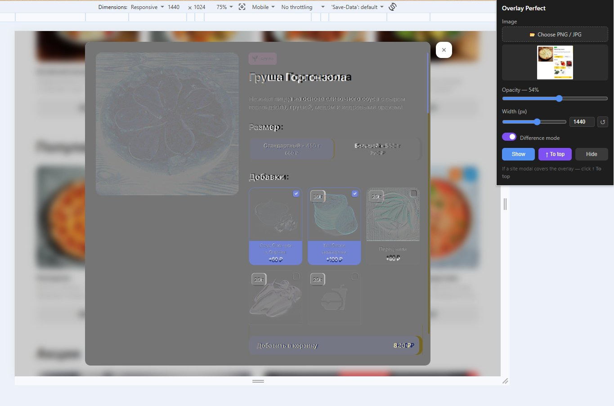

# Overlay Perfect

Chrome-расширение для pixel-perfect проверки вёрстки. Накладывает полупрозрачное изображение поверх любой страницы — в том числе поверх нативных модальных диалогов.

## Возможности

- Наложение PNG/JPG/WebP на любую страницу
- Остаётся поверх нативных `<dialog>` модалок (использует top layer браузера)
- Регулируемая прозрачность и ширина
- Режим инверсии для удобного сравнения с вёрсткой
- Скрытие/показ без потери настроек
- Настройки сохраняются между сессиями

## Установка

Расширение не опубликовано в Chrome Web Store. Установка вручную:

1. Скачайте репозиторий: **Code → Download ZIP**, распакуйте архив
2. Откройте Chrome и перейдите на `chrome://extensions/`
3. Включите **Режим разработчика** (переключатель в правом верхнем углу)
4. Нажмите **Загрузить распакованное расширение** и выберите распакованную папку

Иконка расширения появится на панели инструментов.

## Использование

1. Нажмите на иконку расширения, чтобы открыть попап
2. Нажмите **Choose PNG / JPG** и выберите макет
3. Оверлей сразу появится на странице
4. Настройте **Opacity** (прозрачность) и **Width** (ширину). Кнопка ↺ сбрасывает ширину до оригинального размера изображения
5. **Difference mode** — инвертирует оверлей для удобного сравнения
6. **Hide** — скрывает оверлей и восстанавливает нормальное взаимодействие со страницей
7. **Show** — возвращает оверлей
8. **↑ To top** — использовать если модальное окно сайта перекрыло оверлей

## Лицензия

MIT License

Copyright (c) 2024

Permission is hereby granted, free of charge, to any person obtaining a copy of this software and associated documentation files (the "Software"), to deal in the Software without restriction, including without limitation the rights to use, copy, modify, merge, publish, distribute, sublicense, and/or sell copies of the Software, and to permit persons to whom the Software is furnished to do so, subject to the following conditions:

The above copyright notice and this permission notice shall be included in all copies or substantial portions of the Software.

THE SOFTWARE IS PROVIDED "AS IS", WITHOUT WARRANTY OF ANY KIND, EXPRESS OR IMPLIED, INCLUDING BUT NOT LIMITED TO THE WARRANTIES OF MERCHANTABILITY, FITNESS FOR A PARTICULAR PURPOSE AND NONINFRINGEMENT. IN NO EVENT SHALL THE AUTHORS OR COPYRIGHT HOLDERS BE LIABLE FOR ANY CLAIM, DAMAGES OR OTHER LIABILITY, WHETHER IN AN ACTION OF CONTRACT, TORT OR OTHERWISE, ARISING FROM, OUT OF OR IN CONNECTION WITH THE SOFTWARE OR THE USE OR OTHER DEALINGS IN THE SOFTWARE.
